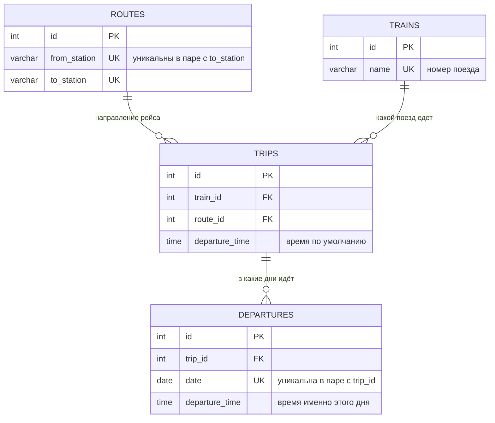

#### App Расписание поездов

Хранение расписания поездов, интерфейс ввода и редактирования, поиск
поездов на произвольную дату средствами MySQL. PHP 8.3 + MySQL 8.4, без фреймворка.

#### Запуск

```bash
cp env.example .env                                  # и поменять пароли
docker compose up -d --build
docker compose exec app composer dump-autoload -o
docker compose exec app php database/migrate.php
docker compose exec app php database/seed.php
```

Приложение поднимется на http://localhost:8080, порт меняется через `APP_PORT` в `.env`.

Сидер разворачивает расписание (поезда 21, 22, 45, 67, 35, 39) на 2022–2026 годы.

#### Диаграмма бд


#### Поиск
| Что ищем | Пример |
| --- | --- |
| конкретный поезд на дату | `/?train=45&date=2022-04-01` |
| маршрут на дату | `/?from=Минск&to=Гомель&date=2022-05-09` |
| любой поезд на дату | `/?date=2022-05-09` |

Фильтры комбинируются, пустые поля игнорируются.

#### Как пользоваться

1. Бургер меню где можно выбрать необходимое действие

2. Страница поиска расписания

3. Все расписания (пагинация)

4. Добавить расписание (вариант как делают в депо, проставка галочками)


5. Календарь рейса `/schedules/{id}` — правка по месяцам. Галочка добавляет или убирает день,
   поле времени рядом задаёт время именно этого дня. Сохраняется месяц целиком.


#### Структура

```
app/Core          PDO, роутер, вьюхи, Request, Flash, CSRF
app/Http          контроллер и form-request'ы с валидацией входа
app/Services      ScheduleService — бизнес-логика
app/Repositories  SQL
app/Models        Trip, Train, Route — сущности
app/Dto           TripFilter — фильтр поиска
app/Support       Format, Calendar, ValidatesDates
database          миграции и сидер
resources/views   шаблоны
```
