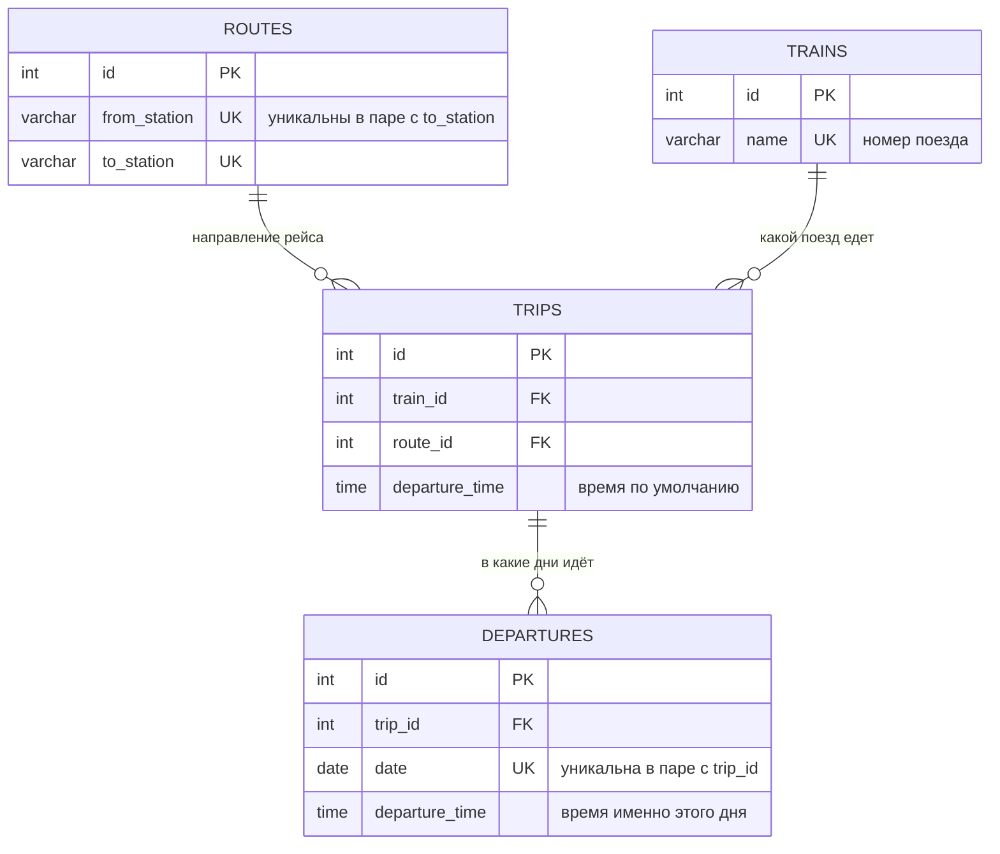

#### App Расписание поездов

#### Диаграмма бд

Рейс отправляется в дату `D`, если в `departures` есть строка с этой датой.
Никаких правил, календарей и исключений в базе нет: поиск — это `WHERE date = ?` по индексу.

Правил в приложении нет вовсе. Расписание на год заполняется галочками на странице
«Добавить расписание»: 12 календарей и кнопки «отметить весь год» по дню недели. Дальше
любой месяц правится на календаре рейса — там же у каждого дня своё время отправления.

В конце года расписание переносится на следующий кнопкой на странице расписаний. Перенос
сдвигает даты на 52 недели, а не на год: дата уезжает на день-два, зато день недели
сохраняется — для расписания это важнее. Чётность числа месяца при этом, разумеется, не
сохраняется. Уже занятые даты перенос не трогает, поэтому ручные правки не затираются.

`App\Support\Recurrence` остался только для сидера: он разворачивает описание из задания
(«по чётным воскресеньям» и т.п.) в список дат на 2022 год.

#### Как пользоваться

